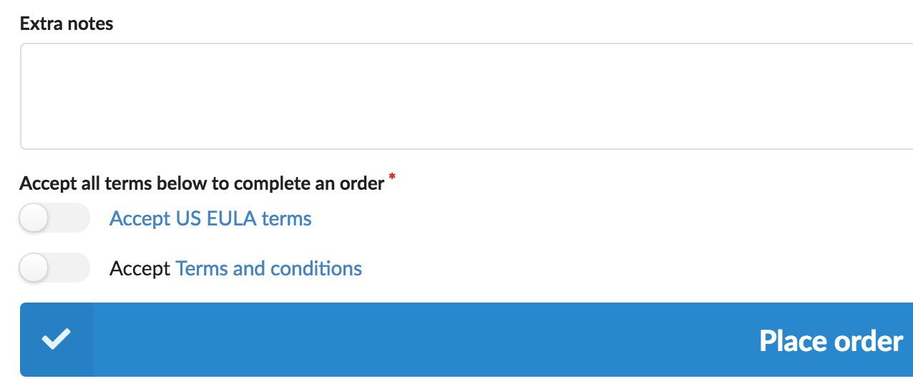
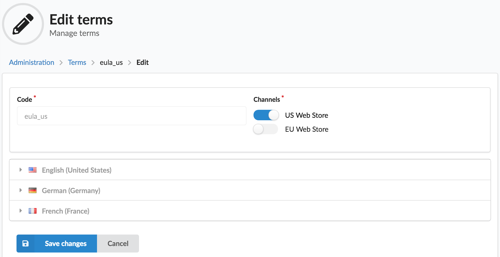
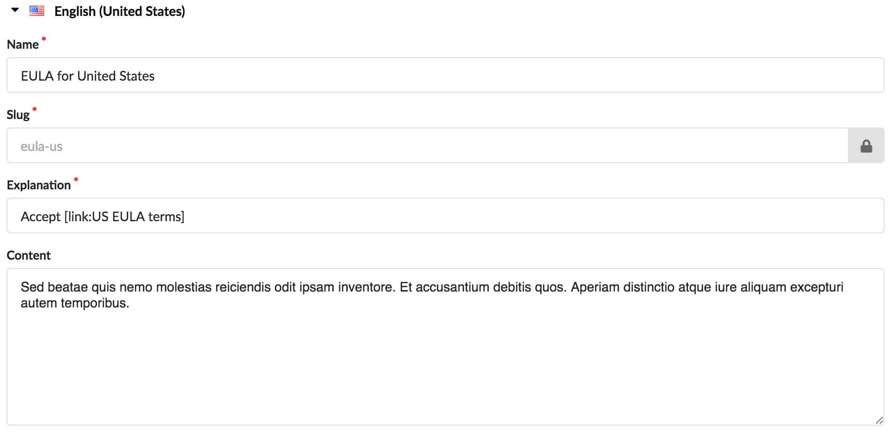

# Sylius terms and conditions plugin

[![Latest Version on Packagist][ico-version]][link-packagist]
[![Software License][ico-license]](LICENSE)
[![Build Status][ico-travis]][link-travis]
[![Quality Score][ico-code-quality]][link-code-quality]

Will add the requirement to check off terms and conditions when the customer checks out

* [Screenshots](#screenshots)
* [Installation](#installation)

## Screenshots

### Shop

Before the customer can place order, he/she has to check the required terms



### Admin

Here is a list of terms. Notice the `terms_and_conditions` which is associated with multiple channels.




The `Explanation` field is the text shown on the complete order page. Notice you can use a placeholder (`[link:Link text]`) to tell where the link should be.



## Installation

### Step 1: Download the plugin

Open a command console, enter your project directory and execute the following command to download the latest stable version of this plugin:

```bash
$ composer require setono/sylius-terms-plugin
```

This command requires you to have Composer installed globally, as explained in the [installation chapter](https://getcomposer.org/doc/00-intro.md) of the Composer documentation.


### Step 2: Enable the plugin

Then, enable the plugin by adding it to the list of registered plugins/bundles
in the `config/bundles.php` file of your project:

```php
<?php
# config/bundles.php
return [
    // ...
    
    Setono\SyliusTermsPlugin\SetonoSyliusTermsPlugin::class => ['all' => true],
    
    // It is important to add plugin before the grid bundle
    Sylius\Bundle\GridBundle\SyliusGridBundle::class => ['all' => true],
    
    // ...
];
```

**NOTE** that you must instantiate the plugin before the grid bundle, else you will see an exception like `You have requested a non-existent parameter "setono_sylius_terms.model.terms.class".`

### Step 3: Import config
```yaml
# config/packages/_sylius.yaml
imports:
    # ...
    
    - { resource: "@SetonoSyliusTermsPlugin/Resources/config/app/config.yaml" }
    
    # ...
```

### Step 4: Import routing

```yaml
# config/routes/setono_sylius_terms.yaml

setono_sylius_terms_shop:
    resource: "@SetonoSyliusTermsPlugin/Resources/config/shop_routing.yaml"
    prefix: /{_locale}
    requirements:
        _locale: ^[a-z]{2}(?:_[A-Z]{2})?$

setono_sylius_terms_admin:
    resource: "@SetonoSyliusTermsPlugin/Resources/config/admin_routing.yaml"
    prefix: /admin
```

**IMPORTANT**: As far as terms pages URLs looks like this
`http://localhost:8000/en_US/terms-conditions`, make sure you don't add
any terms with slugs like `products`, `taxons`, `login`, etc.


### Step 5: Add terms to checkout complete form
Change the view file `templates/bundles/SyliusShopBundle/Checkout/Complete/_form.html.twig`
```twig
 {# This need to be added #}

{{ form_row(form.notes, {'attr': {'rows': 3}}) }}
{{ form_row(form.terms) }}  {# This need to be added #}
  ```

[ico-version]: https://img.shields.io/packagist/v/setono/sylius-terms-plugin.svg?style=flat-square
[ico-license]: https://img.shields.io/badge/license-MIT-brightgreen.svg?style=flat-square
[ico-travis]: https://travis-ci.com/Setono/SyliusTermsPlugin.svg?branch=master
[ico-code-quality]: https://img.shields.io/scrutinizer/g/Setono/SyliusTermsPlugin.svg?style=flat-square

[link-packagist]: https://packagist.org/packages/setono/sylius-terms-plugin
[link-travis]: https://travis-ci.com/Setono/SyliusTermsPlugin
[link-code-quality]: https://scrutinizer-ci.com/g/Setono/SyliusTermsPlugin
